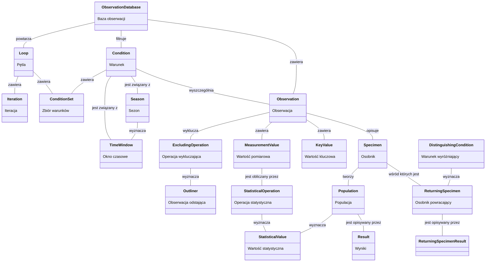

```mermaid
classDiagram

ObservationDatabase : Baza obserwacji
Observation : Obserwacja
Specimen : Osobnik
ReturningSpecimen : Osobnik powracający
Population : Populacja
KeyValue : Wartość kluczowa
MeasurementValue : Wartość pomiarowa
StatisticalValue : Wartość statystyczna
Condition : Warunek
Loop : Pętla
Iteration : Iteracja
StatisticalOperation : Operacja statystyczna
Season : Sezon
TimeWindow : Okno czasowe
Outliner : Obserwacja odstająca
ExcludingOperation : Operacja wykluczająca
DistinguishingCondition : Warunek wyróżniający
ConditionSet : Zbiór warunków
Result : Wyniki

ObservationDatabase -- Observation : zawiera
Observation -- Specimen : opisuje
Specimen -- ReturningSpecimen : wśród których jest
Specimen -- Population : tworzy

Observation -- KeyValue : zawiera
Observation -- MeasurementValue : zawiera
Population -- Result : jest opisywany przez
Population -- StatisticalValue : wyznacza

ObservationDatabase -- Condition : filtruje
Condition -- Observation : wyszczególnia

ObservationDatabase -- Loop : powtarza

MeasurementValue -- StatisticalOperation : jest obliczany przez
StatisticalOperation -- StatisticalValue : wyznacza

Condition -- Season : jest związany z
Condition -- TimeWindow : jest związany z
Season -- TimeWindow : wyznacza

Observation -- ExcludingOperation : wyklucza
ExcludingOperation -- Outliner : wyznacza

DistinguishingCondition -- ReturningSpecimen : wyznacza

Condition -- ConditionSet : zawiera
Loop -- ConditionSet : zawiera
Loop -- Iteration : zawiera

ReturningSpecimen -- ReturningSpecimenResult : jest opisywany przez

```