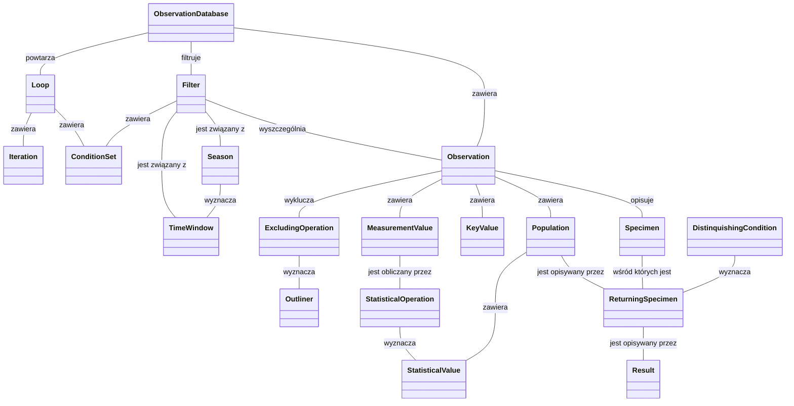

```mermaid
classDiagram

ObservationDatabase -- Observation : zawiera
Observation -- Specimen : opisuje
Specimen -- ReturningSpecimen : wśród których jest
Observation -- Population : zawiera
Population -- ReturningSpecimen : jest opisywany przez

Observation -- KeyValue : zawiera
Observation -- MeasurementValue : zawiera
Population -- StatisticalValue : zawiera

ObservationDatabase -- Filter : filtruje
Filter -- Observation : wyszczególnia

ObservationDatabase -- Loop : powtarza

MeasurementValue -- StatisticalOperation : jest obliczany przez
StatisticalOperation -- StatisticalValue : wyznacza

Filter -- Season : jest związany z
Filter -- TimeWindow : jest związany z
Season -- TimeWindow : wyznacza

Observation -- ExcludingOperation : wyklucza
ExcludingOperation -- Outliner : wyznacza

DistinquishingCondition -- ReturningSpecimen : wyznacza

Filter -- ConditionSet : zawiera
Loop -- ConditionSet : zawiera
Loop -- Iteration : zawiera

ReturningSpecimen -- Result : jest opisywany przez

```